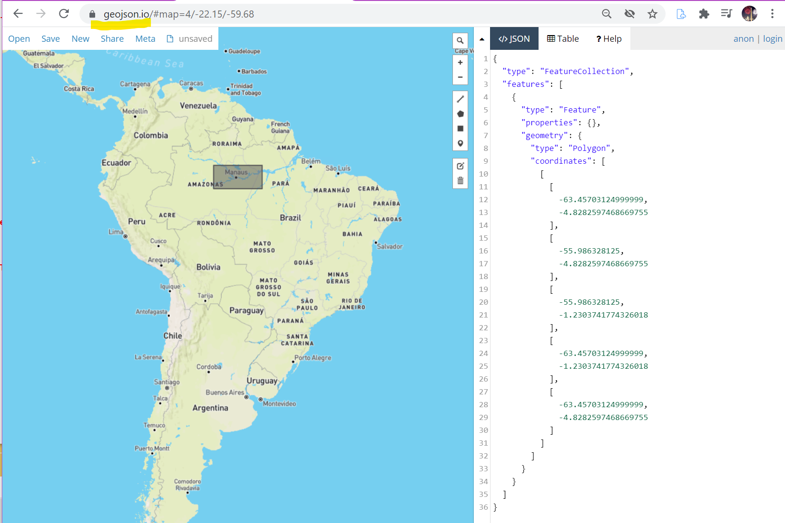

# Planet Labs, SciPy 2018 Conference tutorial

#### Hands-on Satellite Imagery Analysis | SciPy 2018 Tutorial | Sara Safavi  
  * https://www.youtube.com/watch?v=txhjhjWqF7c  
  * github tutorial: https://github.com/planetlabs/notebooks/tree/master/jupyter-notebooks/data-api-tutorials  
  
#### My Notes: 
  * tif file colors are: blue, green, red, near-infared, not red, green, blue, inf.  
  * Use **rasterio** library to manipulate, style similar to Numpy.  
  * import Python libraries: **geojsonio.py** and **geopandas.py**    
  * also **jsonio.py** useful for writing to json file format.  
  * Go through notebook, Planet API for downloading selected geometry.  
  * **geojson.io** website -- good for looking up geojson coordinates from a polygon.   
     * **geojson.io example:** 
     *   

---  

#### Description on YouTube:  
Satellite data is more widely available than ever before, and it is now possible for the public to access sub-weekly and even daily imagery of the Earth's entire landmass. In this tutorial, you will gain hands-on experience exploring publicly-available satellite imagery and using Python tools for geospatial and time-series analysis of medium- and high-resolution imagery data. At the end of the workshop, you will apply what you've learned to investigate real-world environmental and humanitarian challenges. 
 
 This tutorial is for intermediate Python developers. It would help if learners attending this workshop also had some familiarity with map data, but the instructors will not assume background knowledge of satellite imagery or geo-data tools. 
 
 Learners will come away from the workshop with: 
 - a solid understanding of satellite imagery and geo-data concepts; 
 - strategies for wrangling, processing, and analyzing satellite imagery using several Python-based open-source toolkits; 
 - hands-on experience using satellite imagery to better understand and address real-world challenges

Tutorial Information may be found at: https://scipy2018.scipy.org/ehome/299...

See the full SciPy 2018 playlist at https://www.youtube.com/playlist?list...

---  

